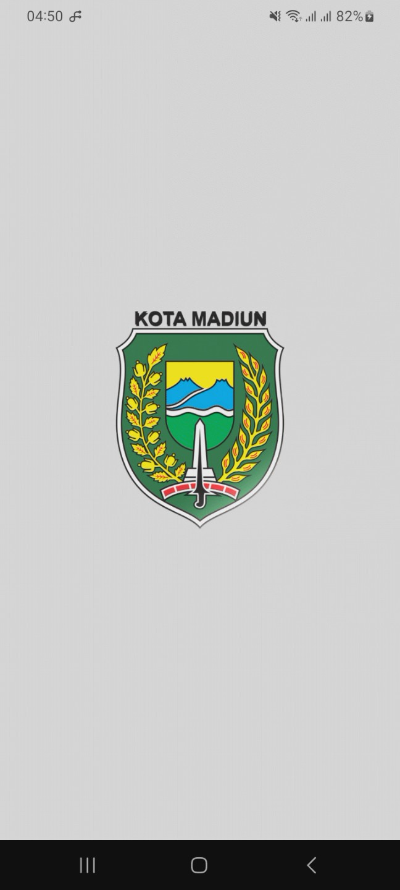
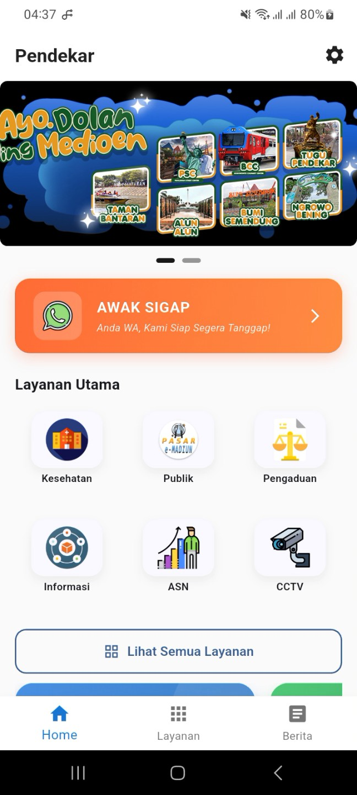
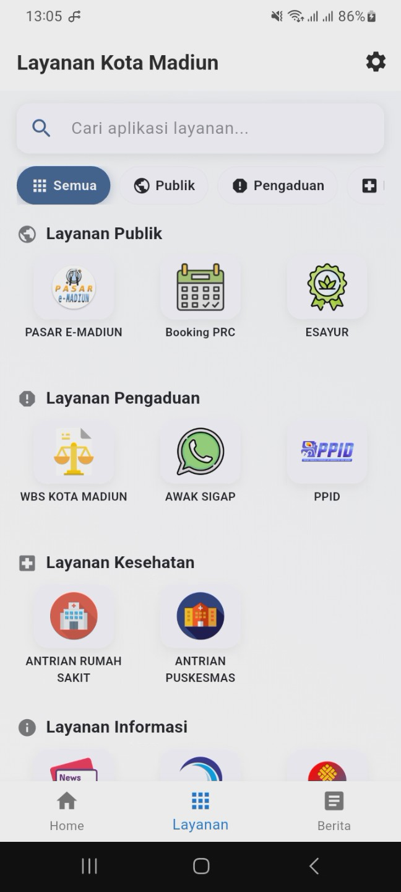
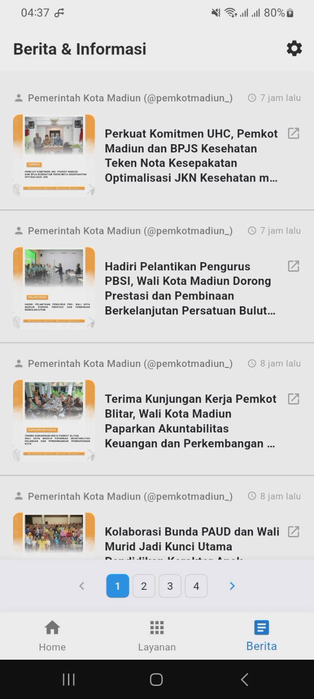
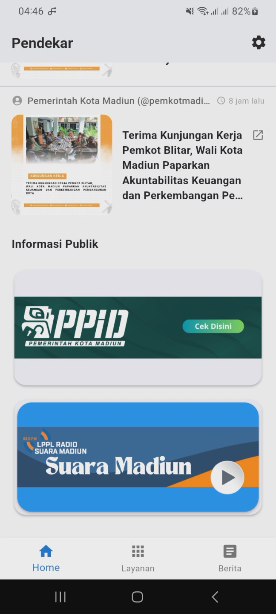
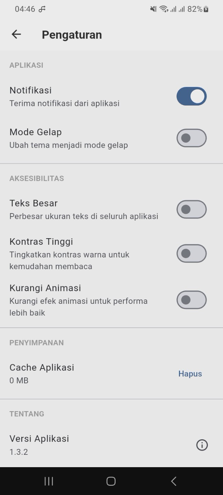

# Aplikasi Pendekar Kota Madiun

Aplikasi mobile smart governance untuk layanan pemerintahan Kota Madiun berbasis Flutter.

## Overview

**Pendekar** (Peceland) adalah aplikasi mobile yang menyediakan akses terintegrasi ke berbagai layanan pemerintahan Kota Madiun. Aplikasi ini menggabungkan portal layanan online, feed berita real-time, radio streaming, dan dukungan pelanggan dalam satu platform yang mudah digunakan.

## 📸 Screenshots

|  |  |  |
|:---:|:---:|:---:|
|  |  |  |

## Fitur

- **Beranda** - Banner carousel, grid menu 50+ layanan, preview berita terbaru, dan radio player 93FM
- **Layanan** - 6 kategori layanan: ASN (E-Office, Absen Rapat), Publik (JDIH, Open Data), Kesehatan, Pengaduan, Informasi, dan UMKM
- **Feed Berita** - Agregasi berita dari 3 RSS feeds dengan infinite scroll pagination
- **Radio Streaming** - Live streaming Suara Madiun 93FM dengan visualisasi audio waveform
- **Pengaturan** - Dark mode, aksesibilitas (font scaling, high contrast), privacy policy, terms & conditions, informasi aplikasi

## Teknologi

- Flutter 3.0.5+
- Android (minimum API 21)
- WebView integration
- Audio streaming (just_audio)
- RSS feed aggregation

## Instalasi

### Persyaratan
- Flutter SDK ≥ 3.0.5
- Android Studio / VS Code dengan Flutter extension
- Android SDK (minimum API level 21)

### Setup

1. Clone repository
```bash
git clone https://github.com/arezyhs/Aplikasi-Kota-Pendekar.git
cd Aplikasi-Kota-Pendekar
```

2. Install dependencies
```bash
flutter pub get
```

3. Jalankan aplikasi
```bash
flutter run
```

## Build Release

### Universal APK (85.8 MB)
```bash
flutter build apk --release
```

### Split APK per arsitektur (53.5 MB - Recommended)
```bash
flutter build apk --split-per-abi
```

### App Bundle untuk Google Play Store
```bash
flutter build appbundle --release
```

## Struktur Proyek

```
Aplikasi-Kota-Pendekar/
├── android/                # Konfigurasi native Android
├── ios/                    # Konfigurasi native iOS
├── assets/                 # Fonts, icons, images (34 MB)
│
└── lib/
    ├── main.dart          # Entry point aplikasi
    ├── routes.dart        # Definisi routing
    │
    ├── screens/           # UI screens
    │   ├── home/          # Home shell & content
    │   ├── layanan/       # 6 kategori layanan screens
    │   ├── berita/        # News feed
    │   └── settings/      # Settings & info pages
    │
    ├── widgets/           # Komponen reusable
    │   ├── home_banner.dart
    │   ├── radio_player.dart
    │   ├── news_preview_widget.dart
    │   └── layanan_utama_widget.dart
    │
    ├── models/            # Data models & structures
    ├── constants/         # Static data & configurations
    ├── api/               # API service layers
    ├── utils/             # Helpers, services & utilities
    └── daftarAplikasi/    # 50+ webview service screens
```

**Arsitektur**: Clean code dengan separation of concerns - screens untuk UI, widgets untuk komponen reusable, models untuk data structures, dan utils untuk helper functions.

## Kontribusi

Proyek ini dikembangkan sebagai bagian dari program magang di **Dinas Komunikasi dan Informatika Kota Madiun**.

## Lisensi

Proyek ini adalah milik Pemerintah Kota Madiun.

## Kontak

- Developer: [@arezyhs](https://github.com/arezyhs)
- Website: https://madiunkota.go.id
- Instagram: @pemkotmadiun_